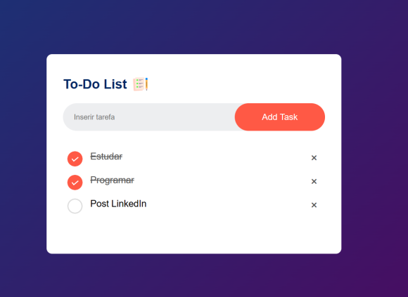

<h1>To-Do List</h1>
  

<h2>Project Deploy</h2>
 <a href="https://to-do-list-fuotd6mnk-lucaslandivar.vercel.app">Click here</a>
  
<h2>Description of the project</h2>

I make a To-Do List in JavaScript, wich helps the user to organize his tasks into a simple way. I already make a project similar (Mymeds), wich help me make the To-Do list a lot easier, but in this project, i also make the function that saves the data in the browser, so even if the user close the browser the list will remain with the same information. With this project i learn more about the DOM and how to create elements, i want to upgrade this project and made a new To-do list with new functions.
 

<h2>Why i make this project?</h2>

I make this project so i can learn how to make a better way to store data in the browser and also to learn how to make a better to do list.

<h2>How does this project work?</h2>

The user can make how many task he want, he have the option to delete the task and also a botton wich means that he complete the task. All the data will be safe in the browser data.

<h2>Tecnologies</h2>

HTML

CSS

JavaScript

<h2>Status</h2>

Finish.

<h2>Author</h2>

Lucas Landivar de Morais

